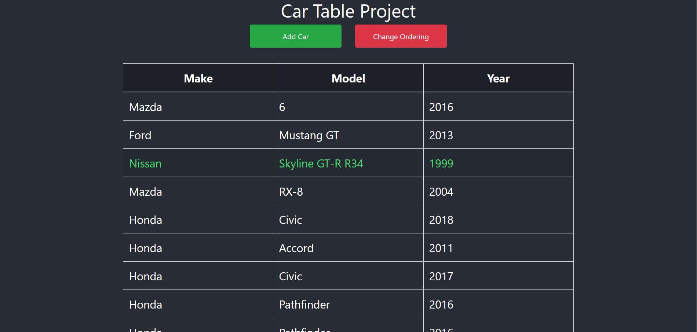

# Car-Table-Project
React app with TypeScript extension to practicing passing props down and also changing column ordering for records in a table.
Features modal for adding inventory car(s) into the main table. 

